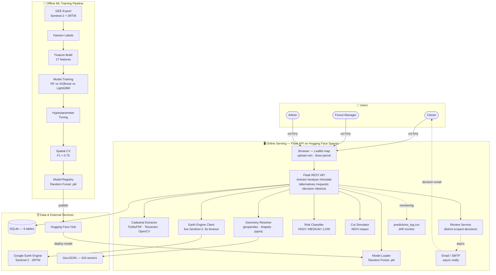

# Shishoza — Architecture Diagram Generation Prompt

Target tool: **Eraser.io / Mermaid**. Deployed model shown: **Random Forest**.
The goal is an *icon-rich, flowing* diagram — like an ML-Ops / Google-search-pipeline
poster — NOT a stack of plain grey boxes. It shows both the **offline ML training pipeline**
and the **online serving app**.

> **Fastest route for Eraser:** skip the AI box and paste the **Eraser diagram-as-code**
> in the next section — it renders the icons and zones deterministically. The MASTER PROMPT
> further below is for Eraser's AI "generate from prompt" field or any other tool.

---

## A · ERASER DIAGRAM-AS-CODE (paste into Eraser → "Diagram as code")

Colored icons + compact clusters + short labels — the three settings that make Eraser
render like a polished ML-Ops poster instead of black icons on a sprawled canvas.
The `colorMode: bold` header is what tints the icons; the clusters are what condense them.

```eraser
colorMode: bold
styleMode: shadow
typeface: clean

// ---- Users ----
Users [color: purple] {
  Citizen [icon: user]
  Manager [icon: user-check]
  Admin [icon: shield]
}

// ---- Web app (tight cluster) ----
WebApp [color: blue, label: "Flask App · Hugging Face Spaces"] {
  Browser [icon: chrome]
  FlaskAPI [icon: flask, label: "Flask REST API"]
  Extractor [icon: scan, label: "Cadastral OCR"]
  Geometry [icon: hexagon, label: "Geometry"]
  EEClient [icon: satellite, label: "EE Client"]
  ModelLoader [icon: cpu, label: "Model Loader · RF"]
  RiskClf [icon: gauge, color: red, label: "Risk Classifier"]
  Simulator [icon: scissors, label: "Cut Simulator"]
  Review [icon: clipboard, label: "Review Service"]
}

// ---- Notifications & monitoring ----
Email [icon: mail, color: orange]
MonLog [icon: activity, color: orange, label: "predictions_log.csv"]

// ---- Data (tight cluster) ----
Data [color: orange] {
  GEE [icon: google-cloud, label: "Earth Engine"]
  DB [icon: database, label: "SQLite"]
  Geo [icon: map, label: "GeoJSON · 416 sectors"]
  HFHub [icon: huggingface, label: "HF Hub"]
}

// ---- ML training (tight row) ----
Training [color: green, label: "Offline ML Training"] {
  Export [icon: download, label: "GEE Export"]
  Hansen [icon: globe, label: "Hansen Labels"]
  Features [icon: table, label: "17 Features"]
  TrainML [icon: git-branch, label: "Train RF/XGB/LGBM"]
  Tuning [icon: sliders, label: "Tuning"]
  SpatialCV [icon: grid, label: "Spatial CV · F1 0.75"]
  Registry [icon: package, label: "Registry"]
}

// ---- Connections ----
Users > Browser: HTTPS
Browser > FlaskAPI
FlaskAPI > Extractor, Geometry, EEClient, ModelLoader, RiskClf, Simulator, Review
Review > Email: notify
Email > Citizen: email
FlaskAPI > MonLog
EEClient > GEE
FlaskAPI > DB
Geometry > Geo
Export > Hansen > Features > TrainML > Tuning > SpatialCV > Registry
Registry > HFHub: publish
HFHub > ModelLoader: deploy RF
```

**Why this looks like the reference posters:**
- `colorMode: bold` → **colored icons**, not monochrome black.
- Nodes grouped into **compact clusters** (Users / WebApp / Data / Training) → Eraser packs
  them tightly instead of fanning across the canvas.
- Short labels + the `FlaskAPI > A, B, C` fan-out syntax → **shorter, fewer long lines**.
- Brand logos (`chrome`, `flask`, `google-cloud`, `huggingface`) render in real colors.

**Icon names** are Lucide-style + brand logos. If a logo name doesn't resolve, Eraser shows a
placeholder — swap it for a generic one (`monitor`, `server`, `cloud`, `box`, `user`, `mail`
always work).

---

## B · MERMAID VERSION (paste into Mermaid / mermaid.live / GitHub / Notion)



Mermaid keeps icons minimal (emoji on the zone titles only). Use the **Eraser** version
above for real per-component icons.

---

## MASTER PROMPT (copy everything in this block)

```
Create a modern, icon-rich SYSTEM ARCHITECTURE diagram for a product called "Shishoza",
a Rwanda forest-loss risk-intelligence platform. Style like a polished ML-Ops / data-pipeline
poster: rounded cards, a distinct icon inside every component, curved directional arrows with
short labels, and coloured shaded zones grouping related components. Font: clean sans-serif
(Inter). NOT a plain layered box stack — make it flow left-to-right and top-to-bottom.

Colour zones (soft tinted background panels):
- GREEN zone  = "Offline ML Training Pipeline" (data science / model building)
- BLUE zone   = "Online Serving — Web App" (Flask API + processing)
- PURPLE zone = "Users"
- AMBER/GREY zone = "Data & External Services"
Primary accent deep forest green #14532D. Risk colours red #DC2626 / orange #EA580C /
green #16A34A used sparingly for the risk-classifier component.

============ ZONE 1 — USERS (purple, top-left) ============
Three actor icons stacked, each a person/role icon with a label:
- "Citizen" (person icon) — uploads a land certificate or draws a parcel on a map.
- "Forest Manager (District)" (person-with-badge icon) — reviews requests in their district.
- "Admin" (shield-person icon) — sees all districts.
Arrow from Users → the Web App zone, labelled "HTTPS".

============ ZONE 2 — ONLINE SERVING WEB APP (blue, centre) ============
Deployed on Hugging Face Spaces (Docker, gunicorn). Draw as a flow:

(a) BROWSER CLIENT card — icons: a map-pin + a document. Label:
    "Browser — Leaflet map · Upload certificate (PDF/photo) · Draw parcel".
    Arrow down → Flask API.

(b) FLASK REST API card (central hub, API/gateway icon) — label "Flask REST API".
    Show its endpoints as small pill chips beside it:
    /extract · /analyse · /simulate · /alternatives · /requests · /decision · /districts

(c) From the Flask API, fan out to a PROCESSING cluster of small icon cards
    (each a different icon), labelled:
    - "Cadastral Extractor" (scanner/OCR icon) — PyMuPDF · pdfplumber · Tesseract · OpenCV
    - "Geometry Resolver" (polygon/vector icon) — geopandas · shapely · pyproj
    - "Earth Engine Client" (satellite icon) — earthengine-api, live Sentinel-2 pull (8s timeout → local fallback)
    - "Model Loader" (brain/ML icon) — loads the trained classifier (scikit-learn / XGBoost)
    - "Risk Classifier" (gauge/traffic-light icon, tinted red-orange-green) — HIGH/MEDIUM/LOW thresholds
    - "Cut Simulator" (scissors/tree icon) — simulates a planned tree cut, NDVI impact
    - "Review Service" (clipboard-check icon) — district-scopes and decides citizen requests

(d) Review Service → dashed arrow labelled "async notify" → "Email / SMTP Service"
    (envelope icon) → arrow to the Citizen actor labelled "decision email".

(e) Flask API → dashed arrow labelled "monitoring log" → "predictions_log.csv"
    (chart-with-heartbeat / drift icon) — feeds an MLOps drift monitor.

============ ZONE 3 — DATA & EXTERNAL SERVICES (amber/grey, right) ============
Cards the serving app reads/writes (arrows from the processing cluster into these):
- "Google Earth Engine" (cloud + satellite icon) — Sentinel-2 imagery + SRTM elevation.
- "SQLite Database" (cylinder DB icon) — tables: USERS, CITIZENS, REQUESTS,
  SIMULATION_RUNS, ALTERNATIVES, ANALYSIS_CACHE.
- "GeoJSON Boundaries" (map/layers icon) — 416 sector polygons for district routing.
- "Hugging Face Hub" (model-repository / box icon) — stores & serves the trained model artifact.

============ ZONE 4 — OFFLINE ML TRAINING PIPELINE (green, bottom band) ============
A clear left-to-right ML pipeline (this is the machine-learning core — make it prominent):
1. "GEE Export" (satellite-download icon) — Sentinel-2 + SRTM, national scale.
2. "Hansen Labels" (globe/ground-truth icon) — deforestation ground-truth labels.
3. "Feature Build" (table/columns icon) — 17 spectral + terrain features, balanced dataset.
4. "Model Training" (brain-gear icon) — trains & compares Random Forest vs XGBoost vs LightGBM.
5. "Hyperparameter Tuning" (sliders icon) — GridSearchCV, 96 combos.
6. "Spatial Cross-Validation" (grid-map icon) — KMeans blocks + GroupKFold, honest F1 ≈ 0.75.
7. "Model Registry → Hugging Face Hub" (package/upload icon) — selected model (XGBoost, ~0.6 MB) exported.
Arrows connect 1→2→3→4→5→6→7 in sequence. A dashed arrow goes from the Model Registry
UP into the serving zone's "Model Loader", labelled "deploy trained model".

============ GLOBAL ============
Use curved arrows, generous spacing, a subtle drop shadow on cards, and a small distinct
icon in EVERY component. Add a title banner at the very top: "Shishoza — System Architecture".
Landscape orientation. No emojis; use clean line/flat icons.
```

---

## Icon cheat-sheet (if the tool lets you pick icons per node)

| Component | Icon to use |
|---|---|
| Citizen / Manager / Admin | person / person-badge / shield-person |
| Browser client | map-pin + document |
| Flask REST API | API gateway / plug |
| Cadastral Extractor | scanner / OCR |
| Geometry Resolver | polygon / vector nodes |
| Earth Engine Client | satellite |
| Model Loader | brain / ML chip |
| Risk Classifier | gauge / traffic light (red-orange-green) |
| Cut Simulator | scissors + tree |
| Review Service | clipboard-check |
| Email/SMTP | envelope |
| Monitoring log | line chart + heartbeat |
| Google Earth Engine | cloud + satellite |
| SQLite | database cylinder |
| GeoJSON boundaries | map layers |
| Hugging Face Hub | box / model repo (🤗 shape) |
| GEE Export | satellite download |
| Hansen labels | globe |
| Feature Build | table columns |
| Model Training | brain + gear |
| Hyperparameter Tuning | sliders |
| Spatial CV | grid over map |
| Model Registry | package upload |

---

## Tips
- If the tool ignores zones, append: *"Group components into 4 coloured background panels
  labelled Users, Online Serving, Data & External, Offline ML Training."*
- If it drops the ML pipeline, generate **Zone 4 alone** as a second diagram, then place it below.
- For Eraser.io / Mermaid, ask it to "output as a flowchart with subgraphs per zone" — it renders
  the four zones as labelled subgraph boxes with icons.
- Keep the hex colours in the prompt; tools honour explicit hex far better than colour names.
```
